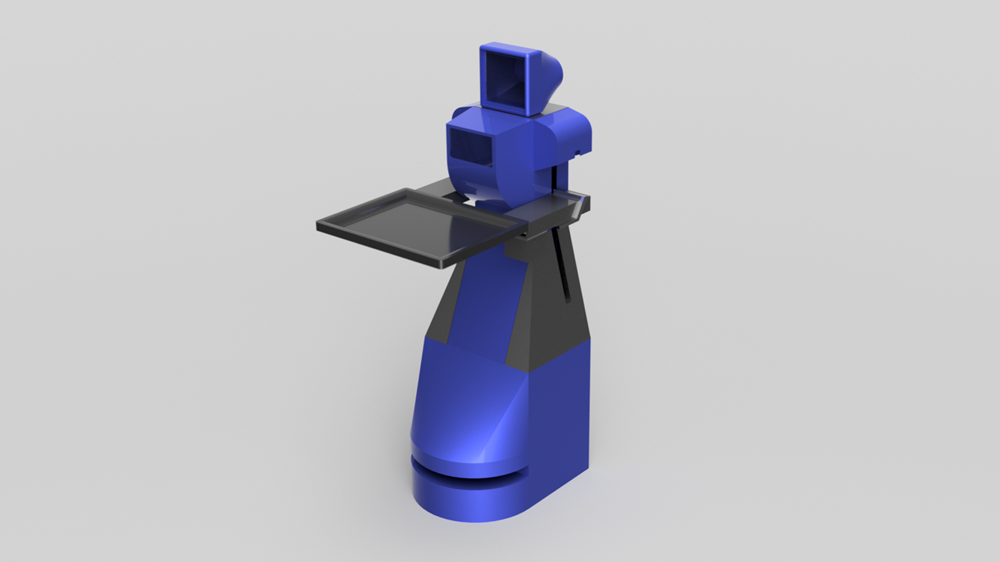
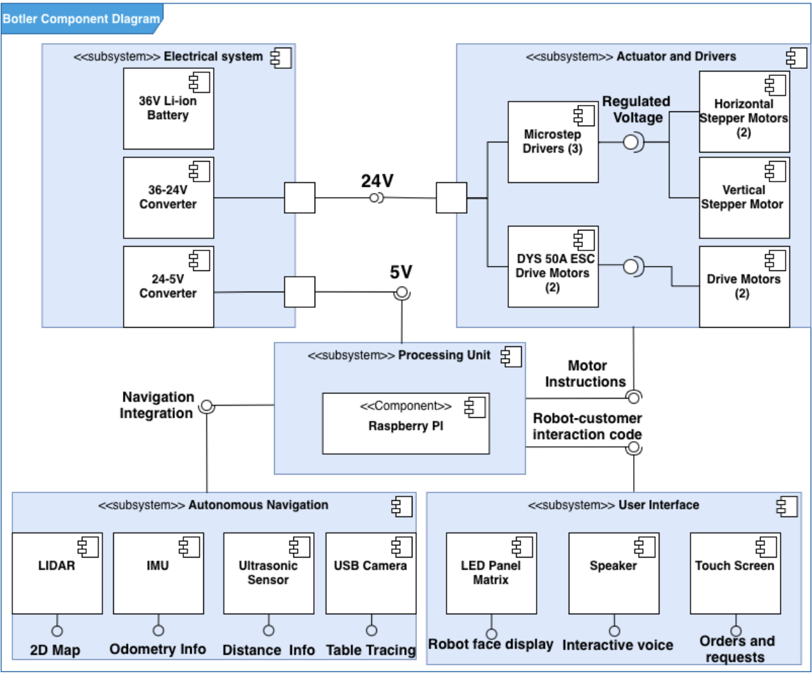
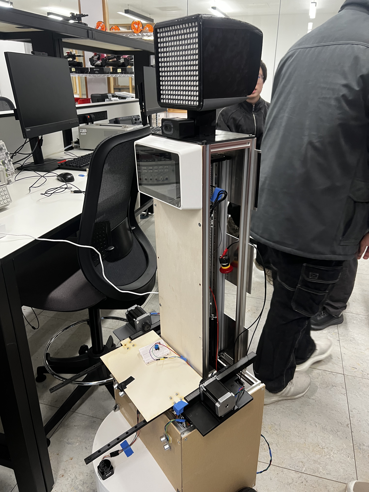
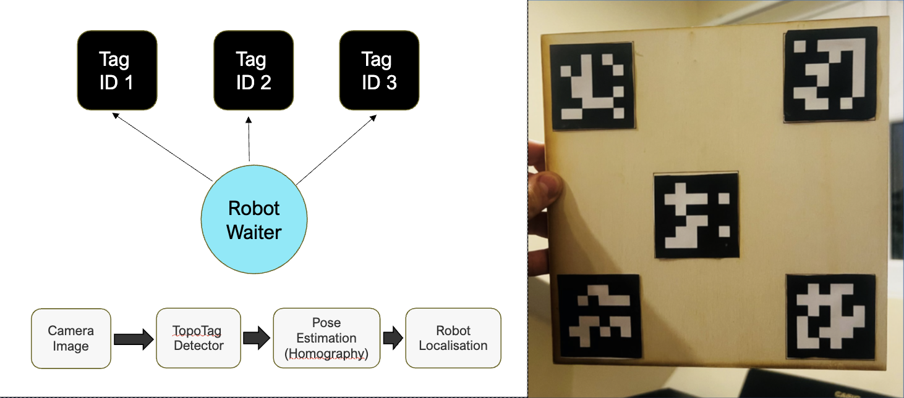

# Botler – Autonomous Robot Waiter

**Advanced Mechatronic Design Project | University of Birmingham**

Botler is an autonomous indoor service robot designed to navigate structured environments and deliver items between predefined stations. The system integrates computer vision, LiDAR, ultrasonic sensing, and inertial measurement to achieve reliable localisation and obstacle avoidance.

---

---

## Overview

The objective of Botler was to design and implement a fully autonomous robot capable of:

- Navigating indoor environments
- Detecting and avoiding obstacles in real time
- Localising itself using visual reference markers
- Executing path planning between service stations
- Operating reliably under real-world constraints

The emphasis was on robustness, modxwular architecture, and clean integration rather than a proof-of-concept prototype.

---

## System Architecture

The system follows a layered architecture:

### Sensor Layer

- LiDAR for environmental scanning
- Ultrasonic sensors for short-range obstacle detection
- IMU for orientation tracking
- Camera module for AprilTag-based localisation

### Processing Layer

- Pose estimation and localisation logic
- A\* path planning algorithm
- Obstacle detection and avoidance
- High-level state machine control

### Control Layer

- Closed-loop motor control
- Heading correction using IMU feedback
- Real-time motion adjustments

---

## Hardware

- Mobile robot chassis
- DC motors with motor drivers
- LiDAR module
- Ultrasonic distance sensors
- IMU
- Camera module
- Onboard compute unit: [Insert board used]
- Power distribution system

---

## Navigation & Localisation

### AprilTag-Based Localisation

AprilTags were deployed within the environment to provide absolute positional references. This reduced drift compared to dead-reckoning approaches and enabled structured indoor localisation without requiring full SLAM implementation.

### Obstacle Detection

- LiDAR used for mid-range environment scanning
- Ultrasonic sensors used for close-range safety
- Sensor fusion approach to increase detection reliability

### Path Planning

The navigation system calculates optimal paths between service nodes using an **A\*** algorithm, dynamically adjusting for detected obstacles.

---

## Control Strategy

The robot operates using a high-level state machine:

- Idle
- Navigate
- Obstacle Avoidance
- Deliver
- Return

Closed-loop control is used for:

- Velocity regulation
- Heading correction
- Stability during movement

The software architecture was designed to be modular and scalable.

---

## Results

- Successful autonomous navigation between predefined stations
- Stable localisation using visual markers
- Reliable obstacle avoidance in indoor conditions
- Full-system integration across mechanical, electrical, and software subsystems

---

## Future Improvements

- SLAM implementation for marker-independent navigation
- Advanced sensor fusion (e.g., Kalman filtering)
- Dynamic mapping of unstructured environments
- Improved path optimisation algorithms
